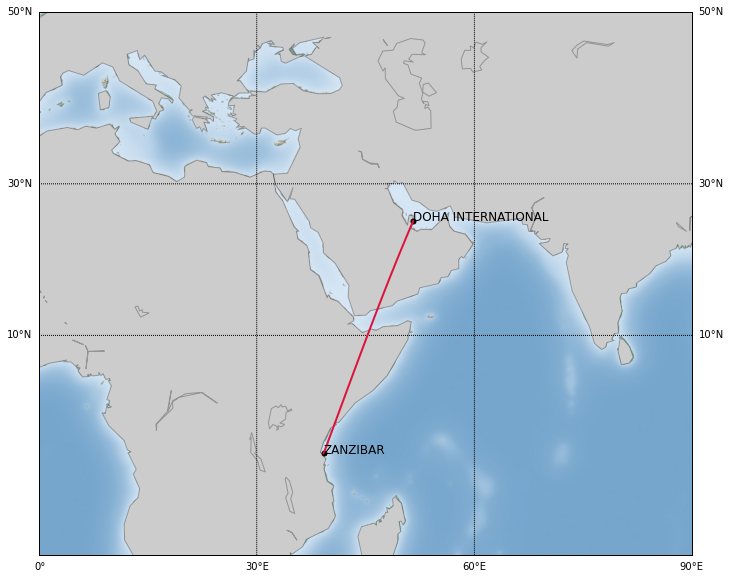

Aerios
==========================
Aerios is an aviation database and coding framework designed for easy deployment of machine learning, probabilistic programming, and optimization under uncertainty methods for commerical aviation. The current aviation data market has numerous vendors of aircraft data (Openflights, Airfleets, FlightAware, Flightradar24, Flightstats, Planefinder), in addition to numerous companies that offer bespoke data-science based algorithms and software products. The goal of this project is to bridge the gap between these two communities. More specifically, our motivation is to not treat the underlying challenges as strictly `data science` ones, but rather to view them through a holistic lens that combines computational statistics, numerical linear algebra, and aerospace engineering.

Some of the key challenges that underpin Aerios is the need for:

* Greater transparency in pollution, noise levels and fuel consumption of aircrafts.
* Techniques for understanding the impact of weather on aircraft network performance.
* Leveraging known lower-order aerodynamic models for performance.
* Utilities for fast visualisation of the data.
* Developing prognostic tools for fleet management and operations--leveraging graph network structures.

Aerios is coded entirely in python and is supported by XML files that contain airline, aircraft (airframe), and engine data. 

**Core modules**

Below is a listing of the core modules.

.. toctree::
   :maxdepth: 5

   flight
   airport
   airplane

